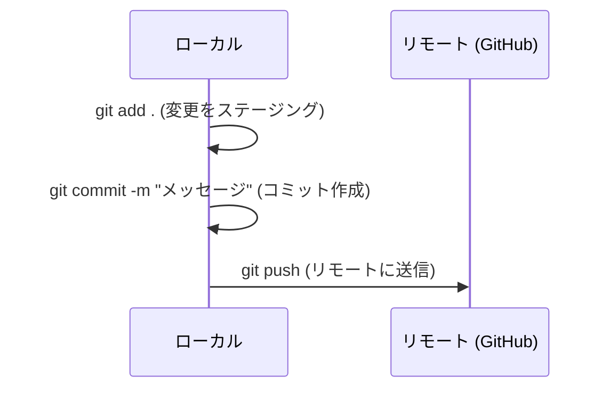
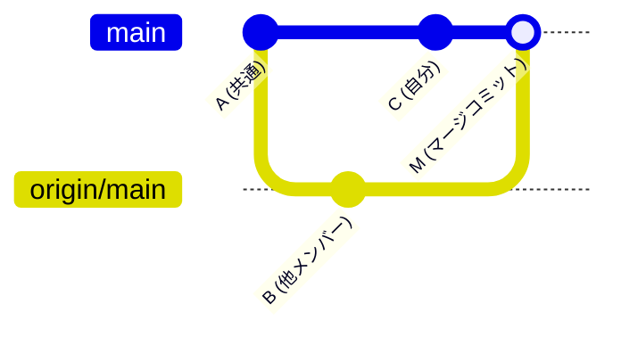
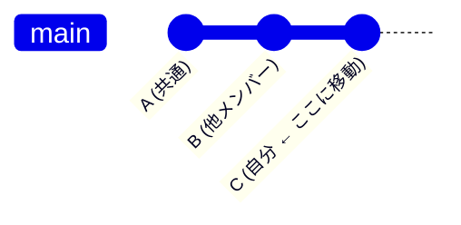
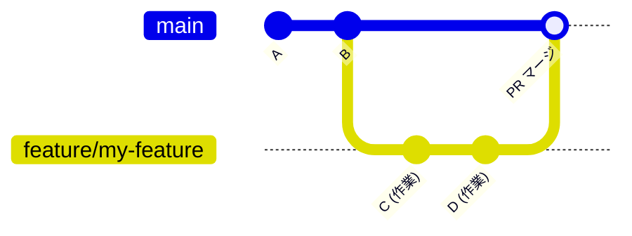

# Git チーム開発ガイド（初心者向け）

このプロジェクトでよく使う Git 操作と、ハマりやすいポイントをまとめたドキュメントです。

---

## 基本の流れ



### コマンド早見表

```bash
git status          # 今の状態を確認
git add .           # すべての変更をステージング
git commit -m "..."  # コミット作成
git push            # リモートに送信
git pull            # リモートの変更を取り込む
git log --oneline   # コミット履歴を1行ずつ表示
```

---

## よくあるトラブルと対処法

### 1. `git push` が rejected（拒否）される

```
! [rejected]  main -> main (fetch first)
error: failed to push some refs to '...'
```

**原因:** 他のメンバーが先にリモートの `main` に変更を push していた。
ローカルの `main` がリモートより古いので、そのまま push できない。

**対処法:**

```bash
git pull          # まずリモートの変更を取り込む
git push          # その後に push
```



---

### 2. 「マージコミット」って何？

`git pull` したときに自動で作られるコミットです。

例えば、こんなログを見たことがありませんか？

```
fdb4b7f  Merge branch 'main' of github.com:periotto3/rakko
c269564  websocketでババ抜きのゲームロジック実装+デプロイ
```

- `c269564` → 自分が書いた実際のコード変更
- `fdb4b7f` → Git が自動生成したマージコミット（自分の変更 + リモートの変更を統合した記録）

**つまり:** マージコミットは「自分の変更」と「リモートの変更」を合流させた、という記録です。中身のコード変更はありません。

---

### 3. マージコミットを作りたくない場合

`git pull --rebase` を使うと、マージコミットを作らずに履歴をきれいに保てます。

```bash
git pull --rebase
git push
```



rebase は自分のコミットを「他メンバーの変更の後ろに付け直す」イメージです。

**デフォルトを rebase にしたい場合:**

```bash
git config pull.rebase true
```

---

### 4. 「divergent branches（分岐したブランチ）」エラー

```
fatal: Need to specify how to reconcile divergent branches.
```

**原因:** `git pull` の挙動が設定されていない。

**対処法（どちらか選ぶ）:**

```bash
# マージ方式（マージコミットが作られる）
git config pull.rebase false

# リベース方式（履歴がきれいになる）
git config pull.rebase true
```

設定後にもう一度 `git pull` を実行すれば OK。

---

### 5. コンフリクト（競合）が起きたら

同じファイルの同じ箇所を複数人が編集すると、Git が自動マージできずコンフリクトが起きます。

**見分け方:** `git status` で `both modified` と表示される。

ファイルを開くと、こんなマーカーが入っています：

```
<<< HEAD
自分の変更
=======
他メンバーの変更
>>> origin/main
```

**対処法:**

1. マーカー（`<<<<<<<`, `=======`, `>>>>>>>`）を削除し、正しいコードだけ残す
2. `git add .`
3. `git commit -m "コンフリクト解消"`
4. `git push`

---

## ブランチ運用

### ブランチを作って作業する（推奨）

`main` に直接コミットするとぶつかりやすいので、**機能ごとにブランチを切る**のがおすすめです。

```bash
# ブランチ作成 & 切り替え
git checkout -b feature/my-new-feature

# 作業してコミット
git add .
git commit -m "新機能を追加"

# リモートに push
git push -u origin feature/my-new-feature

# → GitHub で Pull Request を作成してマージ
```



### このプロジェクトのブランチ例

| ブランチ名                     | 用途                     |
| ------------------------------ | ------------------------ |
| `main`                         | 本番ブランチ             |
| `hoshino/frontend/play_screen` | フロントエンド画面の開発 |
| `f0rte/setup-deploy`           | デプロイ設定             |

**命名規則:** `名前/領域/機能名`（例: `teba/backend/websocket-logic`）

---

## 困ったときの便利コマンド

```bash
# 直前のコミットを取り消す（変更は残る）
git reset --soft HEAD~1

# ステージングを取り消す
git restore --staged .

# ファイルの変更を元に戻す（⚠️ 変更が消える）
git restore <ファイル名>

# 変更を一時退避して、あとで戻す
git stash
git stash pop

# リモートのブランチ一覧を最新化
git fetch --all
```
