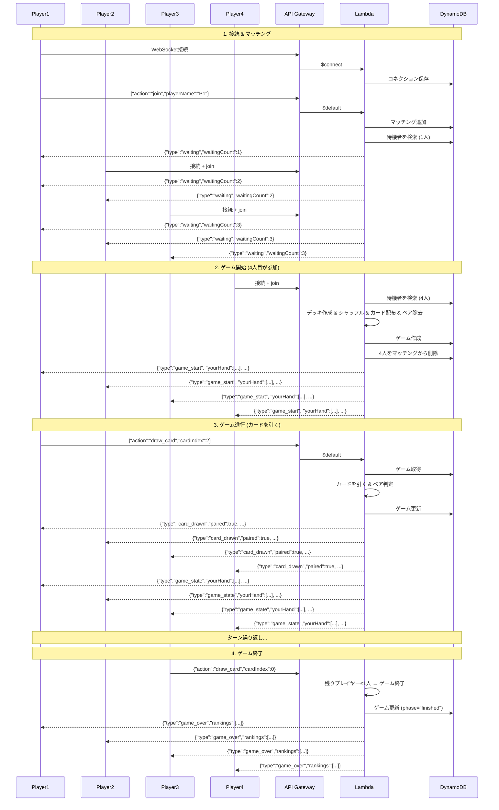
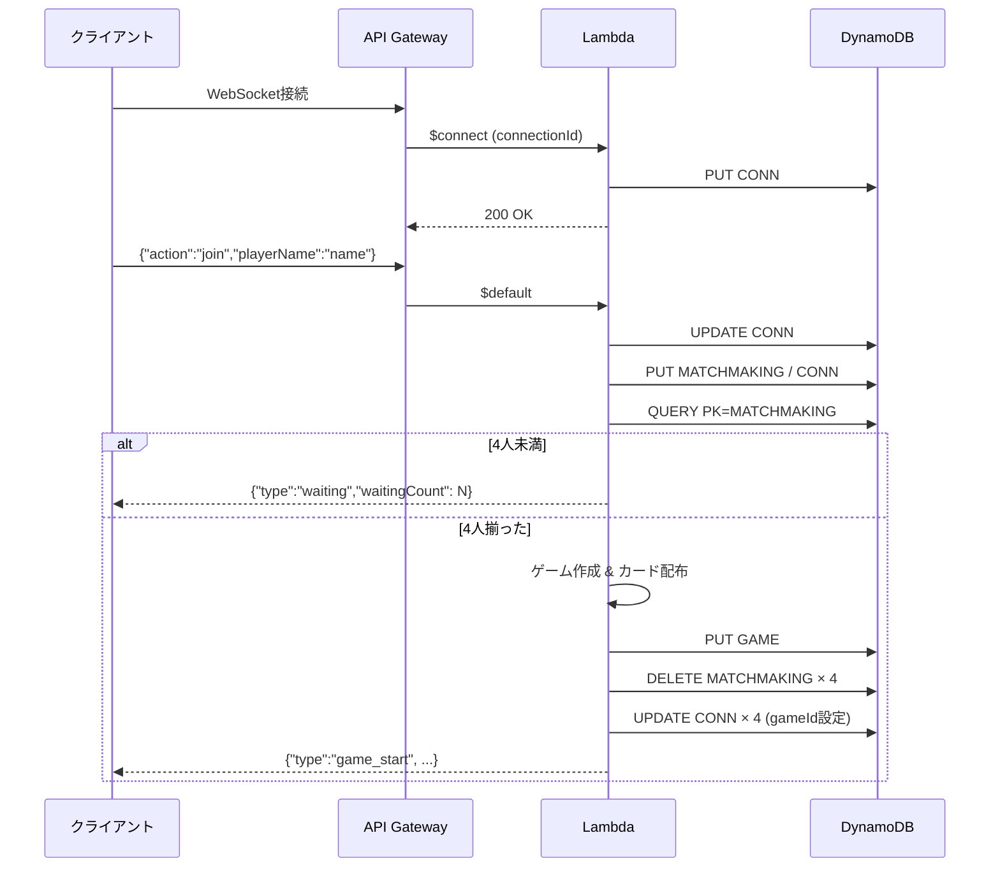
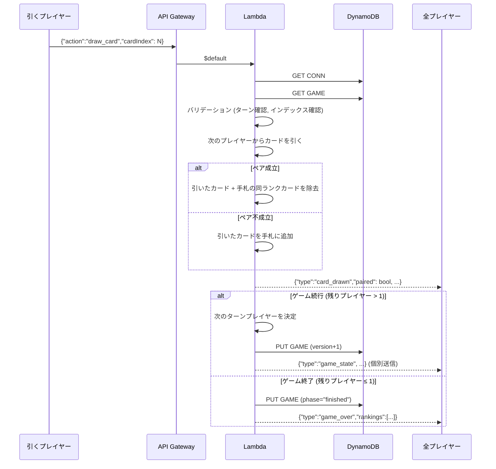
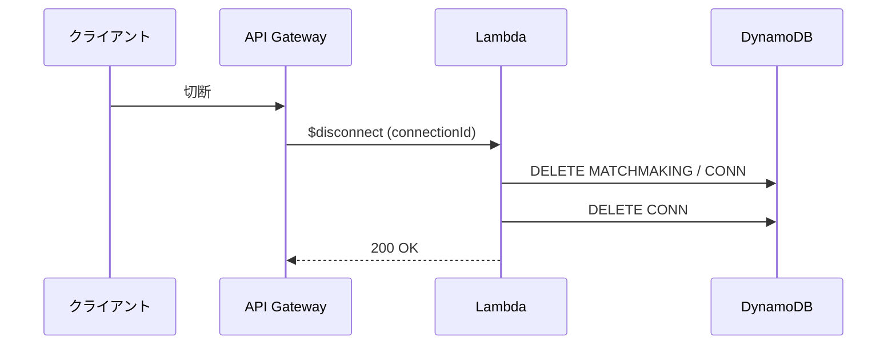

# シーケンス図

## 全体フロー

```mermaid
sequenceDiagram
    participant C1 as Player1
    participant C2 as Player2
    participant C3 as Player3
    participant C4 as Player4
    participant GW as API Gateway
    participant λ as Lambda
    participant DB as DynamoDB

    Note over C1,DB: 1. 接続 & マッチング

    C1->>GW: WebSocket接続
    GW->>λ: $connect
    λ->>DB: コネクション保存

    C1->>GW: {"action":"join","playerName":"P1"}
    GW->>λ: $default
    λ->>DB: マッチング追加
    λ->>DB: 待機者を検索 (1人)
    λ-->>C1: {"type":"waiting","waitingCount":1}

    C2->>GW: 接続 + join
    λ-->>C1: {"type":"waiting","waitingCount":2}
    λ-->>C2: {"type":"waiting","waitingCount":2}

    C3->>GW: 接続 + join
    λ-->>C1: {"type":"waiting","waitingCount":3}
    λ-->>C2: {"type":"waiting","waitingCount":3}
    λ-->>C3: {"type":"waiting","waitingCount":3}

    Note over C1,DB: 2. ゲーム開始 (4人目が参加)

    C4->>GW: 接続 + join
    λ->>DB: 待機者を検索 (4人)
    λ->>λ: デッキ作成 & シャッフル & カード配布 & ペア除去
    λ->>DB: ゲーム作成
    λ->>DB: 4人をマッチングから削除
    λ-->>C1: {"type":"game_start", "yourHand":[...], ...}
    λ-->>C2: {"type":"game_start", "yourHand":[...], ...}
    λ-->>C3: {"type":"game_start", "yourHand":[...], ...}
    λ-->>C4: {"type":"game_start", "yourHand":[...], ...}

    Note over C1,DB: 3. ゲーム進行 (カードを引く)

    C1->>GW: {"action":"draw_card","cardIndex":2}
    GW->>λ: $default
    λ->>DB: ゲーム取得
    λ->>λ: カードを引く & ペア判定
    λ->>DB: ゲーム更新
    λ-->>C1: {"type":"card_drawn","paired":true, ...}
    λ-->>C2: {"type":"card_drawn","paired":true, ...}
    λ-->>C3: {"type":"card_drawn","paired":true, ...}
    λ-->>C4: {"type":"card_drawn","paired":true, ...}
    λ-->>C1: {"type":"game_state","yourHand":[...], ...}
    λ-->>C2: {"type":"game_state","yourHand":[...], ...}
    λ-->>C3: {"type":"game_state","yourHand":[...], ...}
    λ-->>C4: {"type":"game_state","yourHand":[...], ...}

    Note over C1,DB: ターン繰り返し...

    Note over C1,DB: 4. ゲーム終了

    C3->>GW: {"action":"draw_card","cardIndex":0}
    λ->>λ: 残りプレイヤー≤1人 → ゲーム終了
    λ->>DB: ゲーム更新 (phase="finished")
    λ-->>C1: {"type":"game_over","rankings":[...]}
    λ-->>C2: {"type":"game_over","rankings":[...]}
    λ-->>C3: {"type":"game_over","rankings":[...]}
    λ-->>C4: {"type":"game_over","rankings":[...]}
```

---

## マッチング詳細

```mermaid
sequenceDiagram
    participant Client as クライアント
    participant GW as API Gateway
    participant λ as Lambda
    participant DB as DynamoDB

    Client->>GW: WebSocket接続
    GW->>λ: $connect (connectionId)
    λ->>DB: PUT CONN#{connId}
    λ-->>GW: 200 OK

    Client->>GW: {"action":"join","playerName":"name"}
    GW->>λ: $default
    λ->>DB: UPDATE CONN#{connId} (playerName設定)
    λ->>DB: PUT MATCHMAKING / CONN#{connId}
    λ->>DB: QUERY PK=MATCHMAKING

    alt 4人未満
        λ-->>Client: {"type":"waiting","waitingCount": N}
    else 4人揃った
        λ->>λ: ゲーム作成 & カード配布
        λ->>DB: PUT GAME#{gameId}
        λ->>DB: DELETE MATCHMAKING × 4
        λ->>DB: UPDATE CONN × 4 (gameId設定)
        λ-->>Client: {"type":"game_start", ...}
    end
```

---

## カードを引く詳細

```mermaid
sequenceDiagram
    participant Drawer as 引くプレイヤー
    participant GW as API Gateway
    participant λ as Lambda
    participant DB as DynamoDB
    participant All as 全プレイヤー

    Drawer->>GW: {"action":"draw_card","cardIndex": N}
    GW->>λ: $default

    λ->>DB: GET CONN#{connId}
    λ->>DB: GET GAME#{gameId}

    λ->>λ: バリデーション (ターン確認, インデックス確認)
    λ->>λ: 次のプレイヤーからカードを引く

    alt ペア成立
        λ->>λ: 引いたカード + 手札の同ランクカードを除去
    else ペア不成立
        λ->>λ: 引いたカードを手札に追加
    end

    λ-->>All: {"type":"card_drawn","paired": bool, ...}

    alt ゲーム続行 (残りプレイヤー > 1)
        λ->>λ: 次のターンプレイヤーを決定
        λ->>DB: PUT GAME (version+1)
        λ-->>All: {"type":"game_state", ...} (個別送信)
    else ゲーム終了 (残りプレイヤー ≤ 1)
        λ->>DB: PUT GAME (phase="finished")
        λ-->>All: {"type":"game_over","rankings":[...]}
    end
```

---

## 切断

```mermaid
sequenceDiagram
    participant Client as クライアント
    participant GW as API Gateway
    participant λ as Lambda
    participant DB as DynamoDB

    Client->>GW: 切断
    GW->>λ: $disconnect (connectionId)
    λ->>DB: DELETE MATCHMAKING / CONN#{connId}
    λ->>DB: DELETE CONN#{connId}
    λ-->>GW: 200 OK
```
